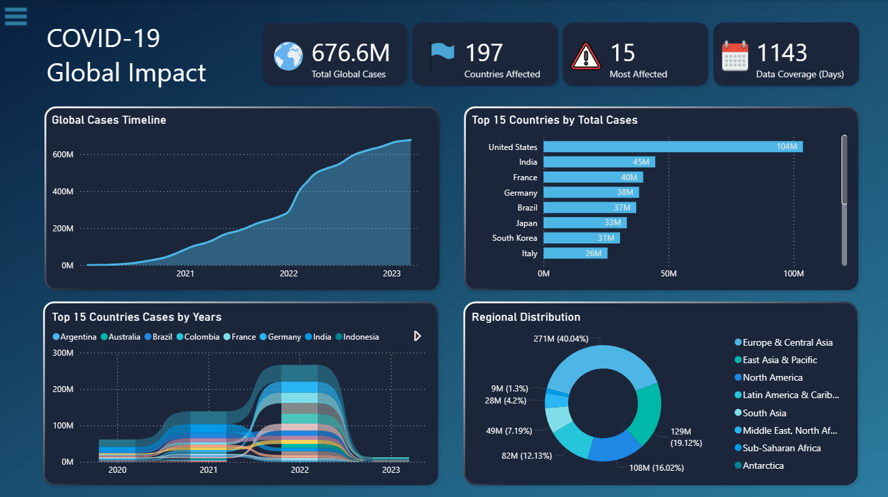
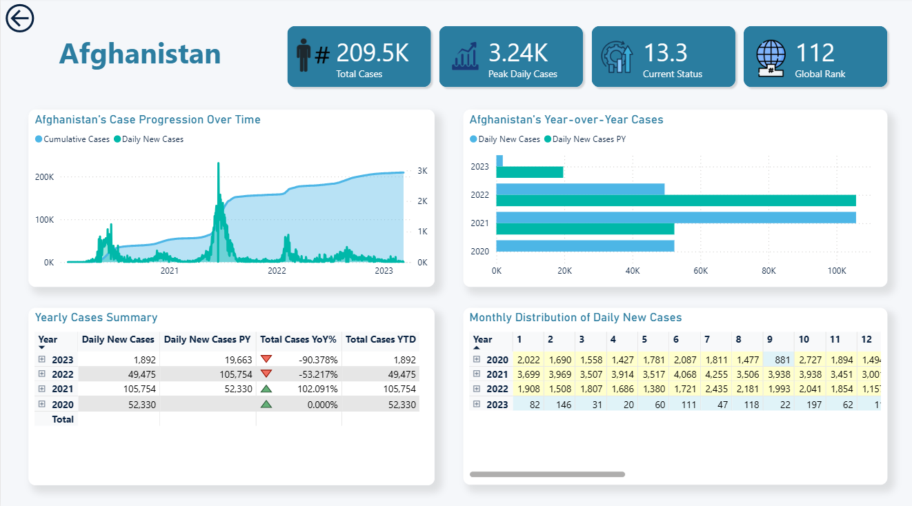

# COVID-19 Global Impact Analysis (Jan 2020 – Mar 2023)

This repository contains a comprehensive analysis of the global impact of the **COVID-19** pandemic, tracking cumulative cases from January 2020 to March 2023.

---

## Business Task

**Analyze and visualize the spread of COVID-19 across 197 countries** to provide a clear, interactive, and insightful overview of the pandemic's progression over time, enabling users to explore global, regional, and country-specific trends.

---

## Tools Used

- **Power Query**: For data ingestion, cleaning, transformation (pivoting, handling nulls), and creating the data model.
- **Power BI**: For dimensional modeling (Star Schema), creating DAX measures, and building an interactive two-page dashboard.
- **Git & GitHub**: For version control and project hosting.

---

## Project Structure

| Folder        | Description                                 |
|---------------|---------------------------------------------|
| `powerbi/`    | Power BI `.pbix` file and dashboard screenshot   |
| `data/`       | Data files (`.csv`) for demonstration            |
| `README.md`   | Project overview, insights, and recommendations  |
| `LICENSE`     | MIT License file (permissions & usage)           |

---

## Data Source

-  **Time Period**: January 22, 2020, to March 9, 2023  
-  **Primary Data**: [COVID-19 Data Repository by the Center for Systems Science and Engineering (CSSE) at Johns Hopkins University](https://github.com/CSSEGISandData/COVID-19/blob/master/csse_covid_19_data/csse_covid_19_time_series/time_series_covid19_confirmed_global.csv)
-  **Supplemental Data**: [World Bank Data API](https://api.worldbank.org/v2/country/all)

---

## Data Processing & Modeling (Power Query)

- **Data Ingestion**: Loaded the time-series data for global confirmed cases
- **Unpivoting**: Transformed the date columns into two rows: 'Date' and 'Cases', creating a normalized structure
- **Data Cleaning**:
  - Checked for and handled null or empty values
  - Removed countries that reported zero total cases throughout the entire period
- **Dimensional Modeling (Star Schema)**:
  - **Fact Table (FactCases)**: The main table containing daily case data
  - **Dimension Table (DimDate)**: Created by extracting date components (Year, Month, Day) from the 'Date' column to facilitate time-based analysis
  - **Dimension Table (DimCountry)**: Created a unique list of countries. This table was merged with an external dataset to add Region and ISO2 codes for enhanced filtering and geographical analysis
- **Model Loading**: The cleaned and modeled tables were loaded into Power BI

---

## Dashboard & Visualizations

An interactive, two-page report was developed to explore the data:

- **DAX Measures**: Created several key measures, including *Total Cases*, *Peak Daily Cases*, *Total Cases YoY %*, and *Total Cases YTD*
- **Main Page (Global Overview)**: Features high-level KPIs, a timeline of global cases, a breakdown of the top 15 countries, and a regional distribution of cases
- **Details Page (Country Drill-Through)**: Provides a detailed view for a selected country, including case progression over time, year-over-year comparisons, and a monthly data summary
- **Side Panel**: Contains a list of countries to choose from and go to **Country Page**, and filters for dynamic exploration

**Dashboard Preview**  
Main Page:

Country Details Page:

Power BI file:  or [Download from Google Drive](https://drive.google.com/file/d/1ioornkcXpJhp57h6ARvgJG-zXl2EuRDX/view?usp=sharing)

---

## Key Insights

- **Global Cases Timeline** shows distinct waves of infection, with a significant acceleration in total cases throughout 2021 and a peak in early 2022, followed by a plateau in 2023
- **Top Affected Countries**:
  - United States leads with 103.8M cases (15.3% of global total)
  - Top 5 countries account for 39% of all global cases
  - Only 15 countries (7.6% of total countries) exceeded 10M cases
- **Regional Impact**:
  - Europe & Central Asia leads with ~271M cases (40%)
  - East Asia & Pacific follows with ~129M cases (19.1%)
- **Multi-Country Comparison**, different countries show distinct curve shapes:
  - USA: Steady exponential growth
  - India: Sharp rise then plateau
  - European countries: Multiple wave patterns
- **Reporting Gaps**: Significant underreporting likely in developing regions

---

## Recommendations & Further Analysis

- Emphasize growth rate trends for early warning
- Predictive modeling integration
- Merging vaccination data would enable an analysis of the correlation between vaccination campaigns and the reduction in new cases or severity
- Include raw data access and API endpoints
- Real-time data updates

---

## License

This project is licensed under the [MIT License](LICENSE)

---

## Author

**Aymen Mohammed** — Data Analyst passionate about using data to tell stories and drive business decisions.

 
 
 
